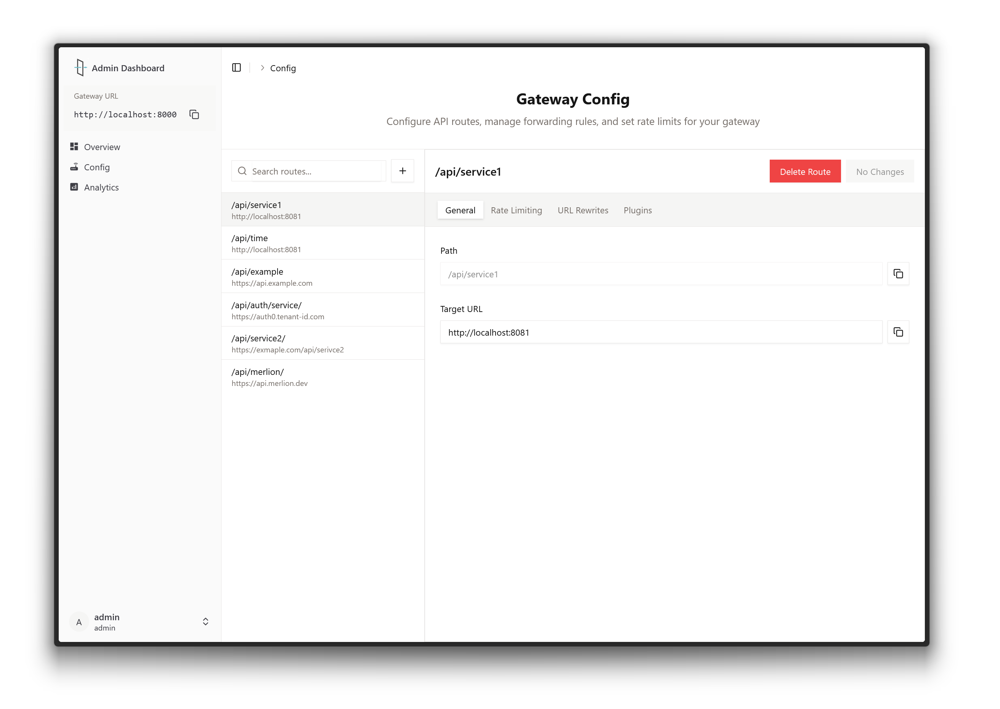
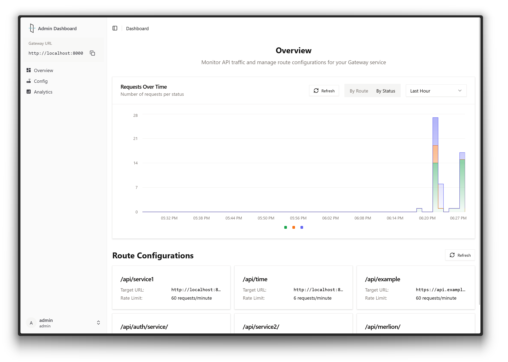

# API Gateway

A lightweight, configurable API Gateway service that provides centralized management for API routing, traffic monitoring, and request control.

## Introduction

This API Gateway serves as a central point of control for managing API traffic across your services. It provides a clean, intuitive dashboard for configuring routes, setting rate limits, monitoring traffic patterns, and applying rules to incoming requests.

## Features

- **Centralized Route Management**: Configure and manage all API routes from a single dashboard
- **Traffic Monitoring**: Real-time monitoring of API traffic with visual analytics
- **Rate Limiting**: Set custom rate limits for each endpoint to prevent abuse
- **URL Rewriting**: Modify request paths to match your backend service requirements
- **Plugin System**: Extend functionality through plugins (coming soon)
- **Configuration UI**: User-friendly web interface for all gateway operations

## Screenshots

### Gateway Configuration



Configure API routes, manage forwarding rules, and set rate limits for your gateway services. The configuration panel allows you to define paths, target URLs, and apply specific rules to each endpoint.

### Dashboard Overview



Monitor API traffic and manage route configurations from a central dashboard. View request rates over time, filter by status or route, and get a quick overview of your service performance.

### Analytics


Detailed analytics on API traffic, request patterns, and response status codes. Identify your most frequently accessed endpoints and monitor the health of your services.

## Getting Started

### Configuration

The gateway can be configured through the web UI and soon with a `config.json` file like the following:

```json
{
  "port": 8000,
  "routes": [
    {
      "path": "/api/service1",
      "targetUrl": "http://localhost:8081",
      "rateLimit": 60
    },
    {
      "path": "/api/time",
      "targetUrl": "http://localhost:8081",
      "rateLimit": 6
    }
  ]
}
```

## Use Cases

- **Microservices Architecture**: Provide a unified entry point for all microservices
- **API Management**: Control and monitor access to your APIs
- **Rate Control**: Protect your services from excessive traffic

## Roadmap

- [ ] `config.json` support for route definition
- [ ] Authentication and authorization plugins
- [ ] Programmable logic on rate limiting
- [ ] Circuit breaker implementation
- [ ] Service discovery integration
- [ ] Caching strategies
- [ ] Request/response transformation
- [ ] OpenAPI specification support

## Contributing

This project is currently in Proof of Concept stage. Feedback and contributions are welcome to help determine future development direction.

# Local Developement

- Frontend Web App - See [app/README.md](./app/README.md) for setup and development
- Backend Service - See [api/README.md](./api/README.md) for setup, development, and testing
